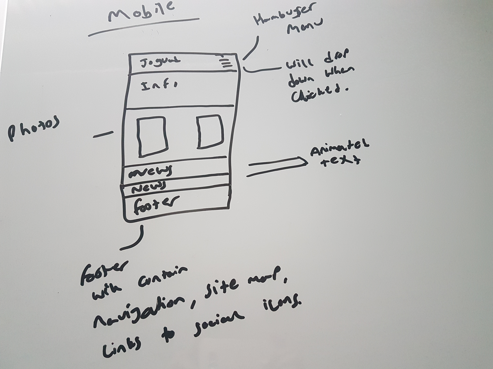
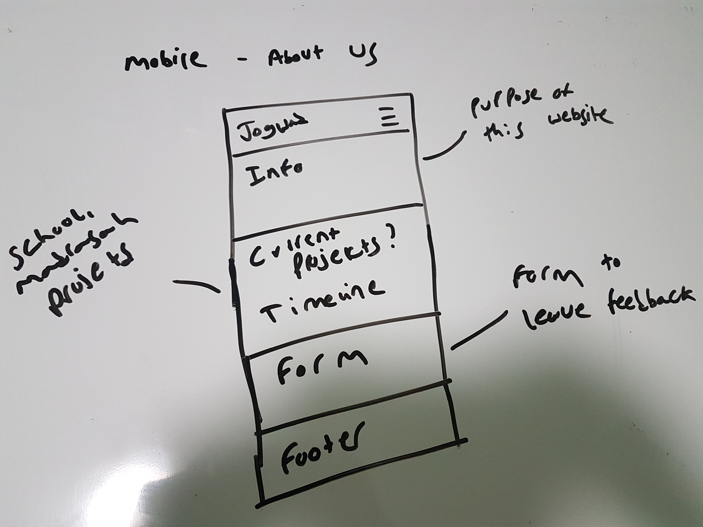
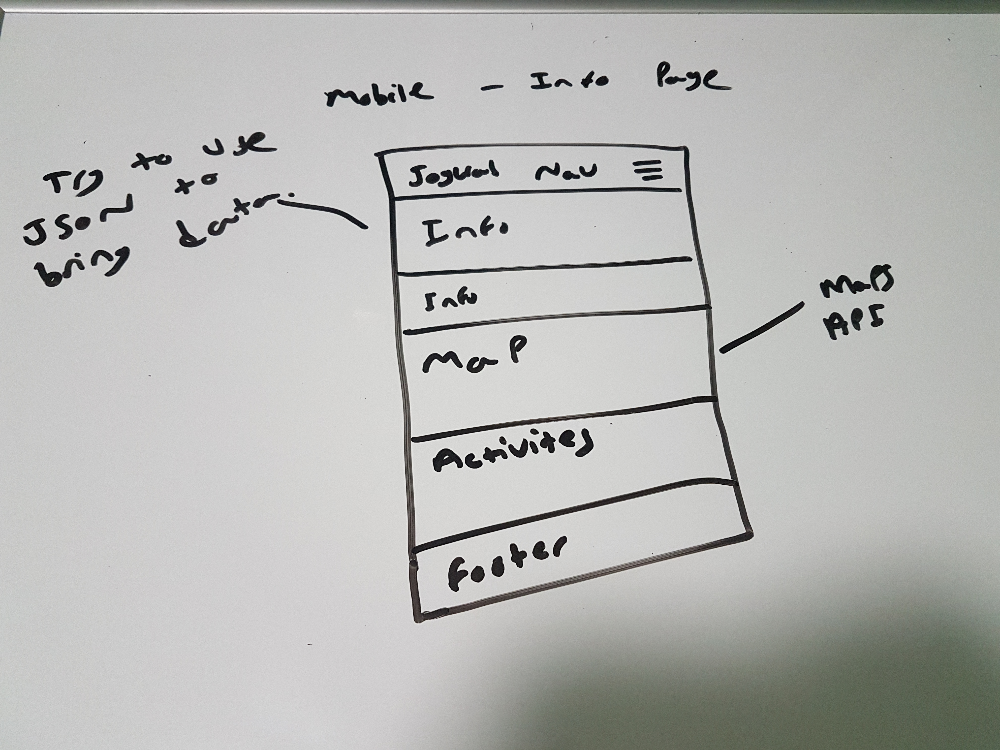
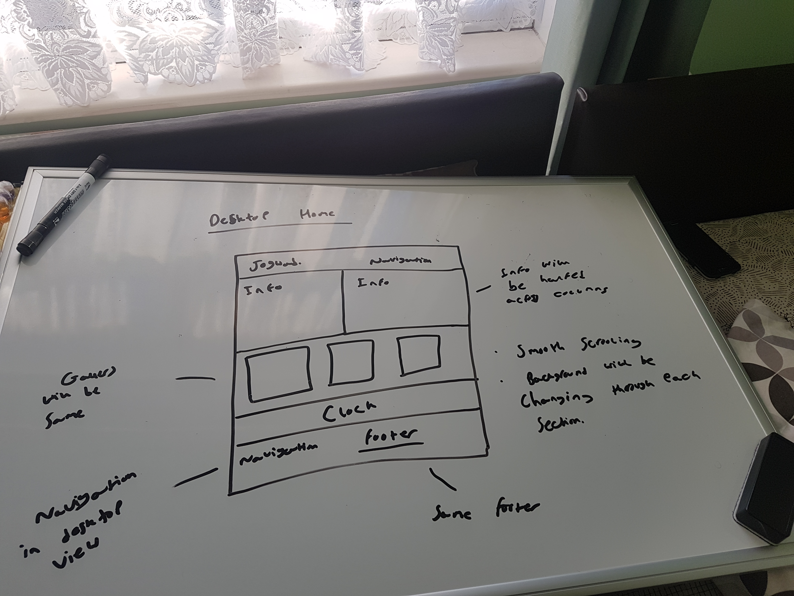
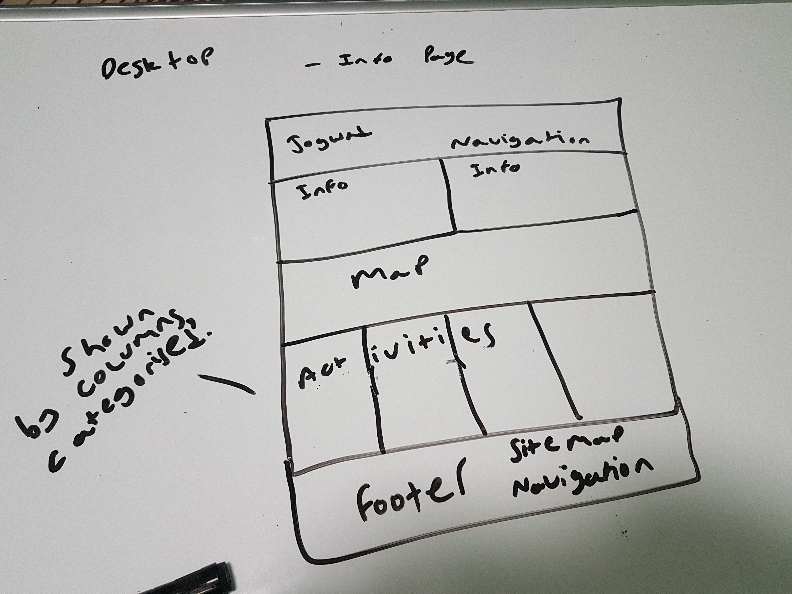
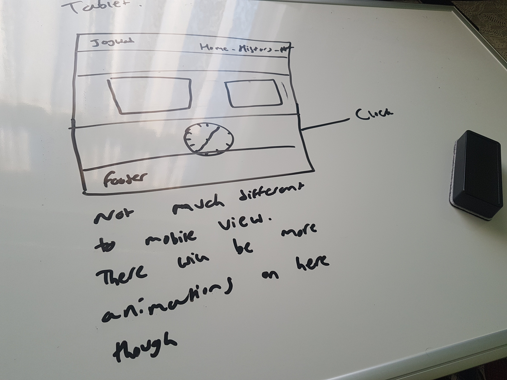
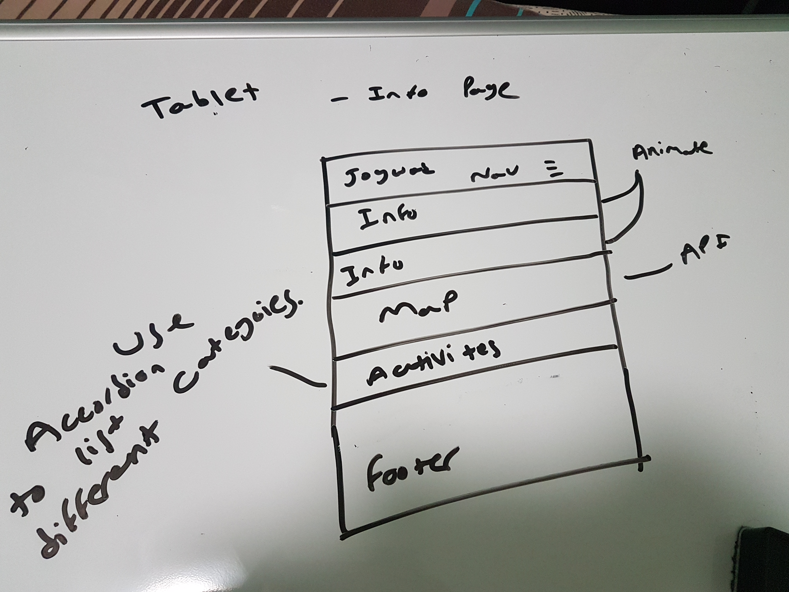

# CTEC3905 Website Assignment

# Soyeb Patel - P15219413

# Purpose 

This website is designed for my village in India, Jogwad. The reason I am doing this is because there is no up-to-date website avaiable for Jogwadwalas to access to get information or to keep up to date with what is happening. 
The site has 4 pages: 
Home
History
Development
Gallery

I made initial drawing of these pages in paper form as I had a rough idea about what I wanted the website to look like.

# Wireframs

# **Languages used**

- HTML5
- CSS3
- JavaScript

I tested my website by running the HTML and CSS code though validatiors. 

Validate                          | Passed/Failed
--------------------------------- | -------------
Index (HTML)                      | Passed
Inf (HTML)                        | Passed
About (HTML)                      | Passed
CSS                               | Errors - No time to go through them all and correct them. Did all I could
JavaScript                        | Passed - (No errors in console)

# User Testing

- I got my uncle to go through the website. Whilst he was doing this I observed him to see what his reactions were to some of the animations and if he struggled with any of the navigation across the website.

From this observation I noticed that he found it hard to read the text on the website due to the color clashing with the background. Therefore, I changed the text color.
Afterwards, I also asked him to tell me what he though about the website. He said:
The menu doesnt look good in red. 
The borders are too thick. 

Based on this I acted upon the suggestion provided and made changes according to it.

# **References**

- (https://cdnjs.cloudflare.com/ajax/libs/font-awesome/4.7.0/css/font-awesome.min.css) - Used for the social media icons in the footer;
- (https://www.w3schools.com/) - Used throughout mainly for inspiration;
- (https://www.codepen.io/) - Used this to look at other peoples work. 
- (https://www.stackoverflow.com/) - Used this when I was looking for online help

# PS 

- I missed the two week extension period. In this period I was away and I did not have internet connection for most part of it.

